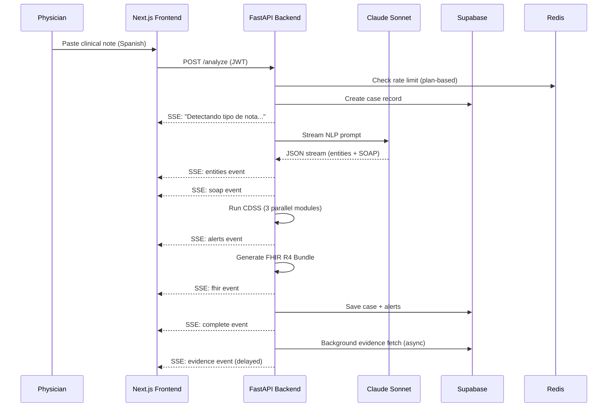

<div align="center">

# CLINOTE

**Clinical NLP SaaS for Spanish-speaking physicians**

Transform free-text Spanish clinical notes into structured SOAP, clinical entities, CDSS alerts, FHIR R4 bundles, and evidence-backed recommendations — in seconds, via streaming.

[](https://www.python.org/)
[](https://fastapi.tiangolo.com/)
[](https://nextjs.org/)
[](https://www.typescriptlang.org/)
[](https://supabase.com/)
[](https://www.anthropic.com/)
[](./backend/tests)
[](./LICENSE)
[](./RGPD.md)

</div>

---

> **Demo GIF** — To add a demo: record your screen processing a sample note, export as GIF
> (recommended: [LICEcap](https://www.cockos.com/licecap/) on Windows/macOS or [Kap](https://getkap.co/) on macOS),
> save as `docs/demo.gif`, then replace this block with:
> ``

---

## The Problem

Spanish-speaking physicians spend 30–40% of their shift writing unstructured clinical notes. These notes contain critical information — drug interactions, lab anomalies, diagnoses — buried in free text, invisible to decision-support systems, impossible to integrate with EHRs, and inaccessible for evidence retrieval.

**CLINOTE solves this.** Paste a clinical note in Spanish. Get back a structured clinical record in under 3 seconds.

---

## Features

- **NLP Entity Extraction** — Diagnoses, medications, allergies, lab values, vital signs, symptoms, procedures, and family history extracted from unstructured Spanish text
- **SOAP Structuring** — Automatic Subjective / Objective / Assessment / Plan generation from free-text notes
- **CDSS Alerts** — Three parallel decision-support modules: RxNorm drug-drug interactions, critical lab value thresholds (35+ rules), and LLM-based contextual reasoning
- **FHIR R4 Bundle** — Valid HL7 FHIR R4 Bundle with Condition, MedicationStatement, Observation, AllergyIntolerance, and Procedure resources — ready for EHR integration
- **Evidence Layer** — Asynchronous PubMed E-utilities + Cochrane search, 24h Supabase cache, delivered via SSE after primary results
- **Real-time Streaming** — Server-Sent Events (SSE) pipeline: status → entities → SOAP → alerts → FHIR → evidence, no polling required
- **Multi-tenant with RLS** — Organizations, users, and cases isolated at the database level via PostgreSQL Row-Level Security (14 policies)
- **Rate Limiting by Plan** — Free: 10 notes/month, 2 req/min · Pro: unlimited notes, 10 req/min · Clinic: 30 req/min
- **Spanish Medical Abbreviations** — 50+ abbreviations handled (HTA, DM2, IAM, EPOC, IRC, and more)
- **RGPD/GDPR Compliant** — Audit log on every action, note hashing (no raw PII in logs), RLS data isolation, right-to-deletion endpoints in roadmap
- **Prompt Injection Protection** — Regex-based sanitizer preserving clinical text (drug doses, lab values, Spanish abbreviations)
- **TOTP MFA** — Available for all users, enforced for admin roles

---

## Architecture

```
┌─────────────────────────────────────────────────────────────────┐
│                        CLINOTE SYSTEM                            │
├─────────────────────────────────────────────────────────────────┤
│                                                                   │
│   Browser / Client                                                │
│   ┌─────────────────────┐                                        │
│   │   Next.js 15        │  App Router + SSR                      │
│   │   Tailwind + shadcn │  Supabase Auth (TOTP MFA)              │
│   │   SSE EventSource   │  Streaming UI (status → results)       │
│   └──────────┬──────────┘                                        │
│              │  POST /api/v1/analyze (JWT Bearer)                │
│              ▼                                                    │
│   ┌──────────────────────────────────────────────────────────┐  │
│   │                  FastAPI (Railway)                        │  │
│   │                                                           │  │
│   │  ┌─────────────┐   ┌──────────────────┐   ┌──────────┐  │  │
│   │  │  NLP Core   │   │  CDSS Engine     │   │ FHIR R4  │  │  │
│   │  │  Claude     │   │  ┌────────────┐  │   │ Mapper   │  │  │
│   │  │  Sonnet     │   │  │ RxNorm API │  │   │          │  │  │
│   │  │  Streaming  │   │  │ Crit. Val  │  │   │ Bundle   │  │  │
│   │  │  JSON parse │   │  │ LLM ctx    │  │   │ FHIR R4  │  │  │
│   │  └──────┬──────┘   │  └────────────┘  │   └────┬─────┘  │  │
│   │         │           └────────┬─────────┘        │        │  │
│   │         └────────────────────┴──────────────────┘        │  │
│   │                              │ SSE stream                 │  │
│   │                              ▼                            │  │
│   │               Background: Evidence Layer                  │  │
│   │               PubMed E-utilities + Cochrane               │  │
│   │               24h cache in Supabase                       │  │
│   └──────────────────┬───────────────────┬────────────────────┘  │
│                       │                   │                        │
│              ┌────────▼──────┐   ┌────────▼────────┐             │
│              │   Supabase    │   │  Redis/Upstash   │             │
│              │  PostgreSQL   │   │  Rate limiting   │             │
│              │  + RLS + Auth │   │  (slowapi)       │             │
│              │  14 policies  │   │  per-plan limits │             │
│              └───────────────┘   └─────────────────┘             │
└─────────────────────────────────────────────────────────────────┘

External APIs
├── Anthropic Claude Sonnet  (NLP extraction + CDSS contextual reasoning)
├── RxNorm / NLM             (drug interaction lookup)
├── PubMed E-utilities       (evidence retrieval)
├── Cochrane Library         (systematic review search)
└── Stripe                   (subscription billing)
```



---

## Tech Stack

| Layer | Technology | Purpose |
|-------|-----------|---------|
| Frontend | Next.js 15 + App Router | React SSR, route protection |
| UI | Tailwind CSS + shadcn/ui | Design system (Navy/Teal palette) |
| Auth | Supabase Auth + TOTP MFA | Multi-tenant auth with MFA |
| Backend | FastAPI + Python 3.11 | Async API, SSE streaming |
| AI | Anthropic Claude Sonnet | NLP extraction + CDSS reasoning |
| Database | Supabase PostgreSQL + RLS | Multi-tenant data isolation |
| Cache | Redis / Upstash | Rate limiting + evidence cache |
| Billing | Stripe | Subscription management |
| Drug DB | RxNorm / NLM API | Drug interaction lookup |
| Evidence | PubMed + Cochrane | Clinical evidence retrieval |
| Frontend Deploy | Vercel | Edge-optimized Next.js hosting |
| Backend Deploy | Railway | Containerized FastAPI hosting |
| CI/CD | GitHub Actions | pytest + tsc + deploy pipeline |
| Standard | FHIR R4 / HL7 | Interoperability bundle output |

---

## Quick Start

**Prerequisites:** Docker, Docker Compose, and API keys for Anthropic and Supabase.

### 1. Clone and configure

```bash
git clone https://github.com/YOUR_USERNAME/clinote.git
cd clinote
cp .env.example .env
```

Edit `.env` with your credentials:

```env
# Anthropic
ANTHROPIC_API_KEY=sk-ant-...

# Supabase
SUPABASE_URL=https://your-project.supabase.co
SUPABASE_ANON_KEY=eyJ...
SUPABASE_SERVICE_ROLE_KEY=eyJ...
NEXT_PUBLIC_SUPABASE_URL=https://your-project.supabase.co
NEXT_PUBLIC_SUPABASE_ANON_KEY=eyJ...

# Redis (docker-compose provides local Redis automatically)
REDIS_URL=redis://redis:6379

# Stripe (optional for local dev)
STRIPE_SECRET_KEY=sk_test_...
STRIPE_WEBHOOK_SECRET=whsec_...
STRIPE_PRO_PRICE_ID=price_...
STRIPE_CLINIC_PRICE_ID=price_...

# PubMed (optional — improves rate limits)
PUBMED_API_KEY=...
```

### 2. Set up Supabase schema

```bash
# Install Supabase CLI: https://supabase.com/docs/guides/cli
supabase link --project-ref YOUR_PROJECT_REF
supabase db push
```

### 3. Start the stack

```bash
docker compose up --build
```

| Service | URL |
|---------|-----|
| Frontend | http://localhost:3000 |
| Backend API | http://localhost:8000 |
| Swagger UI | http://localhost:8000/docs |
| ReDoc | http://localhost:8000/redoc |

---

## API Reference

### Core Endpoint

```
POST /api/v1/analyze
Authorization: Bearer <supabase-jwt>
Content-Type: application/json

{
  "note_text": "Paciente masculino de 65 años con HTA y DM2..."
}
```

**Response:** `text/event-stream` (SSE)

| Event | Payload | Description |
|-------|---------|-------------|
| `status` | `{ stage: string }` | Processing stage updates |
| `note_type` | `{ note_type: string }` | Detected note category |
| `entities` | `{ diagnoses, medications, labs, ... }` | Extracted clinical entities |
| `soap` | `{ subjective, objective, assessment, plan }` | Structured SOAP note |
| `alerts` | `Alert[]` | CDSS decision-support alerts |
| `fhir` | `FHIR Bundle` | HL7 FHIR R4 resource bundle |
| `complete` | `{ case_id, processing_ms }` | Stream end marker |
| `evidence` | `Evidence[]` | PubMed/Cochrane results (async) |

### Other Endpoints

```
GET  /health                          Health check
GET  /api/v1/cases                    List user cases (paginated)
GET  /api/v1/cases/{id}               Get case detail
POST /api/v1/billing/checkout         Create Stripe checkout session
POST /api/v1/billing/portal           Open Stripe customer portal
POST /api/v1/billing/webhook          Stripe webhook receiver (HMAC verified)
```

---

## Screenshots

> Add screenshots to `docs/screenshots/` and uncomment the section below.

<!--
### Editor — Clinical Note Input


### Results — Structured Output with Alerts


### CDSS Alerts — Critical Findings with Two-Step Confirmation


### FHIR Bundle — Export Tab

-->

---

## Running Tests

### Unit Tests (no API key required — fully mocked)

```bash
cd backend
pip install -r requirements.txt
PYTHONPATH=. pytest tests/ -v --ignore=tests/e2e
```

**27/27 tests passing** across 4 test files:

| File | Tests | Coverage |
|------|-------|---------|
| `test_cdss_engine.py` | 9 | Critical value thresholds, parse logic |
| `test_fhir_mapper.py` | 8 | Bundle structure, negation, historical, UUIDs |
| `test_interactions.py` | 4 | Mocked RxNorm, deduplication, sorting |
| `test_nlp_core.py` | 2 | Mocked Claude streaming, negation detection |

### E2E Tests (requires running server)

```bash
CLINOTE_E2E=true CLINOTE_TEST_URL=http://localhost:8000 pytest tests/e2e/ -v
```

### Frontend Type Check

```bash
cd frontend && npm install && npm run type-check
```

---

## Deployment

### Backend → Railway

1. Connect your GitHub repository in the [Railway](https://railway.app/) dashboard
2. Set all environment variables from `.env.example`
3. Railway auto-deploys on push to `main` via `railway.toml`
4. Health check: `GET /health`

### Frontend → Vercel

1. Import the repository in [Vercel](https://vercel.com/), set root directory to `frontend/`
2. Set all `NEXT_PUBLIC_*` and server-side environment variables
3. Vercel auto-deploys on push to `main` via `vercel.json`

### Stripe Webhooks

```bash
# Register in the Stripe dashboard:
https://your-backend.railway.app/api/v1/billing/webhook

# Copy the signing secret to your environment:
STRIPE_WEBHOOK_SECRET=whsec_...
```

### CI/CD (GitHub Actions)

Add these secrets to your GitHub repository settings:

```
RAILWAY_TOKEN
VERCEL_TOKEN
VERCEL_ORG_ID
VERCEL_PROJECT_ID
ANTHROPIC_API_KEY
SUPABASE_URL
SUPABASE_SERVICE_ROLE_KEY
```

The pipeline runs `pytest` + `tsc` + `next build` on every push and PR, then deploys in parallel to Railway and Vercel on merge to `main`.

---

## Project Structure

```
clinote/
├── backend/
│   ├── app/
│   │   ├── routers/        # analyze, cases, billing
│   │   ├── services/       # nlp_core, cdss_engine, fhir_mapper,
│   │   │                   # evidence_layer, audit_service
│   │   ├── middleware/     # auth, rate_limiter
│   │   ├── models/         # request, response, internal
│   │   └── utils/          # crypto, validators, sanitizer
│   ├── prompts/            # NLP system + user prompts
│   ├── tests/              # 27 unit tests + 8 E2E tests
│   └── Dockerfile          # Multi-stage python:3.11-slim, non-root user
├── frontend/
│   ├── app/
│   │   ├── (dashboard)/
│   │   │   ├── editor/     # Note input + SSE progress stages
│   │   │   ├── cases/      # Case list + detail view
│   │   │   └── billing/    # Plan management + usage meter
│   │   ├── (auth)/         # Login + TOTP MFA flow
│   │   └── (landing)/      # Public marketing page
│   ├── components/         # UI components (shadcn + custom)
│   ├── lib/supabase/       # Typed Supabase clients (browser/server/admin)
│   └── Dockerfile          # Multi-stage node:20-alpine, non-root user
├── supabase/
│   ├── migrations/         # 7 tables, 8 indexes, 14 RLS policies
│   └── seed.sql            # 3 users, 5 clinical cases, 7 alerts
├── scripts/
│   └── setup_stripe.py     # Creates Stripe products + prices
├── .github/workflows/      # CI (test) + CD (deploy) pipelines
├── docker-compose.yml
├── ARCHITECTURE.md
├── RGPD.md
├── DISCLAIMER.md
└── BUILD_REPORT.md
```

---

## Clinical Entities Extracted

The NLP pipeline identifies and structures 8 entity categories from unstructured Spanish clinical text:

| Category | Examples |
|----------|---------|
| Diagnoses | HTA, DM2, EPOC, IAM — with negation detection |
| Medications | Drug name, dose, route, frequency — normalized via RxNorm |
| Allergies | Drug/substance, reaction type, severity |
| Lab Values | Hemoglobina 8.2 g/dL, Potasio 6.1 mEq/L |
| Vital Signs | TA 180/100, FC 45 lpm, SpO2 88% |
| Symptoms | Disnea, dolor precordial, mareo |
| Procedures | ECG, RX tórax, ecocardiograma |
| Family History | Padre con cardiopatía isquémica |

---

## CDSS Decision-Support Modules

Three parallel modules run after entity extraction:

1. **Drug Interaction Checker** — Queries the NLM RxNorm interaction API for all extracted medications; deduplicates and sorts by severity
2. **Critical Value Rules Engine** — 35+ threshold rules for lab values and vital signs (e.g., K⁺ > 6.0 mEq/L, SpO₂ < 90%, Hb < 7.0 g/dL)
3. **LLM Contextual Reasoning** — Triggers when the note contains 2+ diagnoses or 3+ medications; uses Claude to identify nuanced clinical risks not captured by rule-based logic

---

## Security and Compliance

- **Authentication:** Supabase JWT on every protected route, TOTP MFA available
- **Authorization:** PostgreSQL RLS enforced at the database level — users access only their organization's data
- **Input Sanitization:** Prompt injection protection via regex sanitizer, preserving clinical text patterns (drug doses, lab values, Spanish abbreviations)
- **Audit Logging:** Every analyze action logged with user ID, IP, user-agent, and note hash — never raw note content
- **No Hardcoded Secrets:** Verified clean in security audit — all credentials via environment variables
- **CORS:** Restricted to configured origins
- **RGPD/GDPR:** Full compliance documentation in [`RGPD.md`](./RGPD.md)

---

## Medical Disclaimer

CLINOTE is a **clinical decision support tool**, not a certified medical device. All output requires physician review and independent clinical judgment. See [`DISCLAIMER.md`](./DISCLAIMER.md) for the full bilingual disclaimer.

---

## Contributing

Contributions are welcome.

1. Fork the repository
2. Create a feature branch: `git checkout -b feature/your-feature`
3. Run the test suite: `cd backend && PYTHONPATH=. pytest tests/ --ignore=tests/e2e`
4. Open a pull request against `main`

See [`BUILD_REPORT.md`](./BUILD_REPORT.md) for known issues and the prioritized development roadmap.

---

## Roadmap

- [ ] PDF export (backend route)
- [ ] RGPD Art. 20 — User data export endpoint
- [ ] RGPD Art. 17 — Account deletion endpoint
- [ ] SNOMED CT code lookup integration
- [ ] RxNorm Spanish trade name normalization
- [ ] PubMed full abstract fetch (currently titles only)
- [ ] Admin dashboard for org management
- [ ] Email notifications for critical alerts
- [ ] Load testing and p50/p95 benchmarks

---

## Built With

- [Anthropic Claude](https://www.anthropic.com/) — LLM for NLP extraction and CDSS reasoning
- [FastAPI](https://fastapi.tiangolo.com/) — Async Python web framework with SSE support
- [Next.js](https://nextjs.org/) — React framework with App Router and SSR
- [Supabase](https://supabase.com/) — PostgreSQL, Auth, and Row-Level Security
- [shadcn/ui](https://ui.shadcn.com/) — Accessible, composable UI components
- [Redis / Upstash](https://upstash.com/) — Serverless Redis for rate limiting and caching
- [Stripe](https://stripe.com/) — Subscription billing and customer portal
- [RxNorm / NLM](https://www.nlm.nih.gov/research/umls/rxnorm/) — Drug normalization and interaction data
- [PubMed E-utilities](https://www.ncbi.nlm.nih.gov/home/develop/api/) — Medical literature API
- [Railway](https://railway.app/) — Backend deployment and hosting
- [Vercel](https://vercel.com/) — Frontend deployment and edge network

---

## License

[MIT](./LICENSE)

---

<div align="center">
Built for Spanish-speaking physicians who deserve better tools.
</div>
