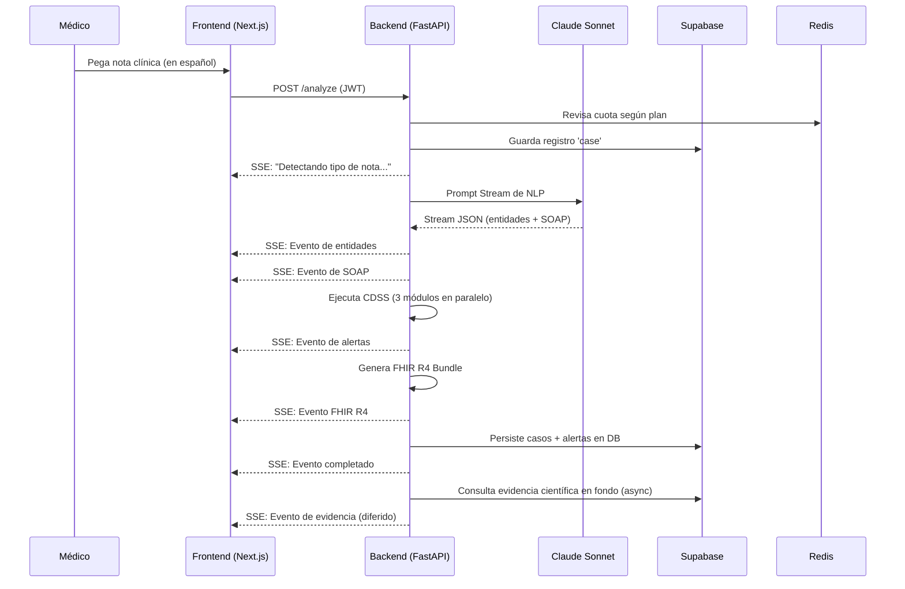

<div align="center">

# CLINOTE

**SaaS Clínico NLP para médicos hispanohablantes**

Transforma notas clínicas en español de texto libre en formato SOAP estructurado, extracción de entidades clínicas, alertas CDSS, bundles FHIR R4 y recomendaciones basadas en evidencia — en segundos, vía streaming.

[](https://www.python.org/)
[](https://fastapi.tiangolo.com/)
[](https://nextjs.org/)
[](https://www.typescriptlang.org/)
[](https://supabase.com/)
[](https://www.anthropic.com/)
[](./backend/tests)
[](./LICENSE)
[](./RGPD.md)

</div>

---

> **Demo GIF** — Para agregar un demo: graba tu pantalla procesando una nota de prueba, expórtala como GIF
> (Recomendado: [LICEcap](https://www.cockos.com/licecap/) en Windows/macOS o [Kap](https://getkap.co/) en macOS),
> guárdalo como `docs/demo.gif`, luego reemplaza este bloque con:
> ``

---

## El Problema

Los médicos hispanohablantes dedican entre el 30% y el 40% de su turno a redactar notas clínicas no estructuradas. Estas notas contienen información crítica — interacciones medicamentosas, anomalías de laboratorios, diagnósticos — escondida en texto libre de forma que los sistemas de apoyo a decisiones (CDSS) no la ven. Es imposible integrarlo con los EHR (Historia Clínica Electrónica) convencionales resultando inoperativo e inaccesible para recuperar información basada en la evidencia.

**CLINOTE soluciona esto.** Inserta una nota clínica en español. Recibe una historia formatizada y estructurada en menos de 3 segundos.

---

## Características

- **Extracción NLP de Entidades** — Diagnósticos, medicamentos, alergias, valores de laboratorio, signos vitales, síntomas, procedimientos y antecedentes familiares detectados a partir de texto libre en español.
- **Estructuración SOAP** — Generación automática del esquema Subjetivo / Objetivo / Análisis / Plan directamente de los apuntes no estructurados.
- **Alertas CDSS** — Tres módulos independientes que trabajan en paralelo para predecir e informar decisiones: consultas de interacciones (por RxNorm), niveles críticos de laboratorios (más de 35 reglas) y el análisis de contexto por LLM para razonamientos sutiles.
- **Bundle FHIR R4** — Salida compatible en HL7 FHIR R4 Bundle con recursos de Condition, MedicationStatement, Observation, AllergyIntolerance y Procedure — preparados para integración a Historias Clínicas.
- **Capa de Evidencia** — Proceso en segundo plano usando PubMed E-utilities + Búsqueda en Cochrane, resultados almacenados en Supabase (caché de 24h), integrados por eventos de Server-Sent Event (SSE) una vez evaluados.
- **Streaming en Tiempo Real** — Pipeline Server-Sent Events (SSE): estado → entidades → SOAP → alertas → FHIR → evidencia, no se necesita carga o *polling*.
- **Aislamiento Multiusuario (Multi-tenant) a Nivel RLS** — Los usuarios, organizaciones, perfiles y datos permanecen ocultos con Políticas RLS seguras en PostgreSQL (14 políticas).
- **Límites de Peticiones** — Plan gratis: 10 notas/mes, 2 req/min · Plan Pro: Notas ilimitadas, 10 req/min · Plan Clínico: 30 req/min.
- **Abreviaturas Clínicas en Español Resueltas** — Soporte para más de 50 abreviaturas comúnmente usadas como HTA, DM2, IAM, EPOC, IRC de manera natural e impecable.
- **Cumplimiento y Regulaciones (RGPD)** — Trazabilidad en auditorías o logs, cifrado de todas las notas (eliminando PII real en los servidores), reglas aisladas, e infraestructura pensada en regulaciones.
- **Defensa ante Inyección de Prompts** — Sanitizaciones a nivel regex, filtrando basura para garantizar la legibilidad humana.
- **TOTP MFA (Autenticación de 2 Factores)** — Soporte de Google Authenticator.

---

## Arquitectura

```
┌─────────────────────────────────────────────────────────────────┐
│                        SISTEMA CLINOTE                           │
├─────────────────────────────────────────────────────────────────┤
│                                                                   │
│  Navegador / Cliente                                              │
│   ┌─────────────────────┐                                        │
│   │   Next.js 15        │  App Router + SSR                      │
│   │   Tailwind + shadcn │  Supabase Auth (TOTP MFA)              │
│   │   SSE EventSource   │  Streaming UI (estado → resultados)    │
│   └──────────┬──────────┘                                        │
│              │  POST /api/v1/analyze (JWT Bearer)                │
│              ▼                                                    │
│   ┌──────────────────────────────────────────────────────────┐  │
│   │                  FastAPI (Railway)                        │  │
│   │                                                           │  │
│   │  ┌─────────────┐   ┌──────────────────┐   ┌──────────┐  │  │
│   │  │  Núcleo NLP │   │  Motor CDSS      │   │ Mapper   │  │  │
│   │  │  Claude     │   │  ┌────────────┐  │   │ FHIR R4  │  │  │
│   │  │  Sonnet     │   │  │ API RxNorm │  │   │          │  │  │
│   │  │  Streaming  │   │  │ Val. Crít. │  │   │ Bundle   │  │  │
│   │  │  Parseo JSON│   │  │ Contx. LLM │  │   │ FHIR R4  │  │  │
│   │  └──────┬──────┘   │  └────────────┘  │   └────┬─────┘  │  │
│   │         │           └────────┬─────────┘        │        │  │
│   │         └────────────────────┴──────────────────┘        │  │
│   │                              │ SSE stream                 │  │
│   │                              ▼                            │  │
│   │               Búsqueda Evidencia (Background)             │  │
│   │               PubMed E-utilities + Cochrane               │  │
│   │               Caché 24h en Supabase                       │  │
│   └──────────────────┬───────────────────┬────────────────────┘  │
│                       │                   │                        │
│              ┌────────▼──────┐   ┌────────▼────────┐             │
│              │   Supabase    │   │  Redis/Upstash   │             │
│              │  PostgreSQL   │   │  Rate limiting   │             │
│              │  + RLS + Auth │   │  (slowapi)       │             │
│              │  14 políticas │   │  límites x plan  │             │
│              └───────────────┘   └─────────────────┘             │
└─────────────────────────────────────────────────────────────────┘

APIs Externas
├── Anthropic Claude Sonnet  (Extracción NLP + razonamiento CDSS)
├── RxNorm / NLM             (Búsqueda de interacciones de medicamentos)
├── PubMed E-utilities       (Búsqueda de artículos científicos médicos)
├── Biblioteca Cochrane      (Búsqueda de reseñas sistémicas)
└── Stripe                   (Suscripciones y pasarela de cobros)
```



---

## Tecnologías

| Capa | Tecnología | Objetivo |
|-------|-----------|---------|
| Frontend | Next.js 15 + App Router | Renderizado SSR en React, protección de rutas |
| Interfaz UI | Tailwind CSS + shadcn/ui | Sistema visual (Paleta "Navy/Teal") |
| Autenticación | Supabase Auth + TOTP MFA | Autenticación multi-tenant y 2FA/MFA |
| Backend | FastAPI + Python 3.11 | API Asíncrona, streaming mediante SSE |
| IA | Anthropic Claude Sonnet | Extracción NLP + procesamiento de análisis CDSS |
| Base de Datos | Supabase PostgreSQL + RLS | Aislamiento de información mediante permisos SQL explícitos |
| Caché Memoria | Redis / Upstash | Controlador de Límite (Rate limiting) y recursos Cacheados |
| Cobranza / Pagos | Stripe | Administración de subscripciones a plataforma |
| Base Medicación | API NLM RxNorm | Revisión de interacción cruzada de fármacos o medicinas |
| Buscador Documental | PubMed + Cochrane | Extracción de Literatura, guías y avances |
| Despliegue Web | Vercel | Hosting de despliegue sobre Edge Net para Next.js |
| Despliegue Back | Railway | Framework para contenedor de Backend API |
| CI/CD Pipeline | Acciones GitHub | Automatizador con pytest, tsc y push hacia servidores |
| Interoperabilidad | Estandard de HL7 FHIR (R4) | Entregable encriptado formato FHIR listos a acoplar EHRs |

---

## Inicio Rápido (Quick Start)

**Requisitos previos:** Necesitarás instalado Docker, Docker Compose, Claves API funcionales en Anthropic, Supabase y un GitHub Pat a mano.

### 1. Clonar el repositorio y arrancar

```bash
git clone https://github.com/MI_USUARIO/clinote.git
cd clinote
cp .env.example .env
```

Edita `.env` con las credenciales necesarias:

```env
# Anthropic
ANTHROPIC_API_KEY=sk-ant-...

# Supabase
SUPABASE_URL=https://tu-proyecto.supabase.co
SUPABASE_ANON_KEY=eyJ...
SUPABASE_SERVICE_ROLE_KEY=eyJ...
NEXT_PUBLIC_SUPABASE_URL=https://tu-proyecto.supabase.co
NEXT_PUBLIC_SUPABASE_ANON_KEY=eyJ...

# Redis (Las instrucciones en docker-compose levantarán contenedores dependientes en Local automáticamente)
REDIS_URL=redis://redis:6379

# Stripe (Opcional si solo quieres ver la aplicación local/pruebas gratuitas)
STRIPE_SECRET_KEY=sk_test_...
STRIPE_WEBHOOK_SECRET=whsec_...
STRIPE_PRO_PRICE_ID=price_...
STRIPE_CLINIC_PRICE_ID=price_...

# PubMed (Opcional - previene error "Límite Excedido -Rate Limits")
PUBMED_API_KEY=...
```

### 2. Sincroniza y Carga Esqueletos para Base de Datos Supabase

```bash
# ¡Instala la Utilidad de Líneas CLI (Comandos) de Supabase! -> https://supabase.com/docs/guides/cli
supabase link --project-ref EL_HASH_DEL_PROYECTO_TU_PROYECTO
supabase db push
```

### 3. Levantar la pila de desarrollo por Contenedores Docker

```bash
docker compose up --build
```

| Servicio | URL |
|---------|-----|
| Módulo Front (Interfaz) | http://localhost:3000 |
| Módulo Backend (Servidor API) | http://localhost:8000 |
| Interfaz API de Prueba Swagger | http://localhost:8000/docs |
| ReDoc | http://localhost:8000/redoc |

---

## Referencia de API Principal

### Endpoint Clave

```
POST /api/v1/analyze
Authorization: Bearer <supabase-jwt>
Content-Type: application/json

{
  "note_text": "Paciente masculino de 65 años con HTA y DM2. Refiere molestia y dolor punzante transcurrida su ingesta de analgésico."
}
```

**Respuesta:** Datos Servidos por el API Server (`text/event-stream` (SSE)) en streaming.

| Evento de Llegada | Payload JSON de Contenido | Propósito |
|-------|---------|-------------|
| `status` | `{ stage: string }` | Estado actual cargando (Update Progreso). |
| `note_type` | `{ note_type: string }` | Categoría identificada mediante análisis de tipo de nota. |
| `entities` | `{ diagnoses, medications, labs, ... }` | Recopilación detectada y extraída. |
| `soap` | `{ subjective, objective, assessment, plan }` | Información Estructurada (Esquemas de evaluación S-O-A-P) generados del reporte dictado. |
| `alerts` | `Alert[]` | Contiene información importante desde CDSS (Motor Decisiones de Apoyo). |
| `fhir` | `Contenido Estructura FHIR` | El Recurso agrupado interoperacional de la nota como dictan las leyes de HL7. |
| `complete` | `{ case_id, processing_ms }` | Notificador de Término / Límite Cierre. |
| `evidence` | `Evidencias[]` | Repositorio asincrónico cargado con contenido Médico. |

### Otros Endpoints Menores:

```
GET  /health                          Chequeo en estado del server
GET  /api/v1/cases                    Lista los Casos / Registros Históricos Atendidos y Procesados del doctor (Permite Navegación).
GET  /api/v1/cases/{id}               Detalles internos desde base de los Registros Históricos Clínicos.
POST /api/v1/billing/checkout         Genera o lanza conexión hacia procesador checkout vía STRIPE
POST /api/v1/billing/portal           Maneja redirección para acceder al Menú del Stripe Portal y gestionar membresías
POST /api/v1/billing/webhook          Procesador receptor y validador de subscripciones
```

---

## Capturas de Pantalla (Screenshots)

> Añade tus capturas de pantalla a la ruta `docs/screenshots/` y descomenta esta sección.

<!--
### El Redactor / Editor de Texto - Interfaz Natural


### Las Alertas a La Toma de Decisiones


### Alertas Críticas (Motor CDSS) - Validación a Confirmación 2 Fases (Two-Step Confirmation)


### Exportando a Configuración y Arquitectura Estándar: Archivos FHIR Bundle

-->

---

## Para Comprobar la Correcta Compilación (Running Tests)

### Pruebas Unitarias Core del Negocio (Sin llaves de pago o dependencias externas)

```bash
cd backend
pip install -r requirements.txt
PYTHONPATH=. pytest tests/ -v --ignore=tests/e2e
```

**27/27 Tests pasando su análisis** a través de 4 archivos vitales de testeo y debug geo local.

| Categorías De Testeos | Chequeos | Cobertura |
|------|-------|---------|
| `test_cdss_engine.py` | 9 | Motores de búsqueda de Umbrales Críticos, Lógica Parser de Números. |
| `test_fhir_mapper.py` | 8 | Validando formatos y negaciones semánticas, recursos lógicos históricos de UUID Bundle. |
| `test_interactions.py` | 4 | Simulador Falsificación Controlada a API RxNorm (Mocks), re-acondicionante y de orden de purificación. |
| `test_nlp_core.py` | 2 | Simulador Mock Claude Stream y de negación NLP. |

### Pruebas E2E / De Extremo a Extremo (Requieren tener la API prendida, servidor disponible localhost:8000)

```bash
CLINOTE_E2E=true CLINOTE_TEST_URL=http://localhost:8000 pytest tests/e2e/ -v
```

### Verificación Frontend Tyescript

```bash
cd frontend && npm install && npm run type-check
```

---

## Poniendo en Producción (Estrategias de Deploy)

### 1- Aplicación Servidor a Railway

1. Crea / Sincroniza este proyecto Git frente a tus instancias Servidores usando el panel central de Dashboard de  [Railway](https://railway.app/).
2. Sube variables ENV que pide la base guiada `.env.example`.
3. Todos tus lanzamientos desde consola GitHub automáticamente se despacharán a despliegue Railway si existe empuje a `Main` gracias al archivo base `railway.toml`.
4. El Estado de validación final debe corroborar con un `GET /health` como éxito a terminal.

### 2- Despliegue Frontend a Vercel

1. Usa la UI principal al Panel App en [Vercel](https://vercel.com/) buscando este repositorio importado base para sincronizarlos; establece `/frontend/` como su Raíz Root.
2. Agrega en sus panel Vercel cada Entorno Público Ambiental y ServerSide Secrets de Variables desde base `NEXT_PUBLIC_*`.
3. Sincronización se detecta automáticamente (auto-deploys) en push. Utilidades Vercel se leen de `vercel.json`.

### Pagos a Suscripciones vía Stripe Webhooks (Servicios Configuración Seguros Ocultos)

```bash
# Registra Endpoints URL desde la terminal Panel en tu app de Subscripciones Stripe (Webhooks URL) usando: 
https://tuservidor-api-a-elegir.railway.app/api/v1/billing/webhook

# Al Terminar Copia la Llave Creada del Proceso Oculto hacia ti Configuración de Variables Global:
STRIPE_WEBHOOK_SECRET=whsec_...
```

### GitHub Automator "Pipelines CI / CD Acciones Remotas Automatizadas"

Incluye de favor en repositorios "Github Secets":

```
RAILWAY_TOKEN
VERCEL_TOKEN
VERCEL_ORG_ID
VERCEL_PROJECT_ID
ANTHROPIC_API_KEY
SUPABASE_URL
SUPABASE_SERVICE_ROLE_KEY
```

El proyecto de repositorios está amparado de Pipelines. Al generar tu primer PR / Empuje Branch, probará y compilará mediante "Next / Pytest", despachándose con rapidez automática hacia Railway y Vercel en Main.

---

## Árbol y Mapa Estructurado del Proyecto

```
clinote/
├── backend/
│   ├── app/
│   │   ├── routers/        # Entradas (endpoints): analyze, cases, billing
│   │   ├── services/       # nlp_core, cdss_engine, fhir_mapper, evidence_layer, audit_service
│   │   ├── middleware/     # Auth JWT y rate_limiter (Control flujos límite de red)
│   │   ├── models/         # Pydantic schemas Request, Responses
│   │   └── utils/          # Utilidades para encriptación de reportes RGPD o saneamiento de basura regex
│   ├── prompts/            # Instrucciones al motor LLM y de NLP
│   ├── tests/              # 27 Base Test Scripts Unitarios y 8 End tests integrales E2E
│   └── Dockerfile          # Imagen Multi-Nivel Basada de Python liviano
├── frontend/
│   ├── app/
│   │   ├── (dashboard)/
│   │   │   ├── editor/     # Ingreso/editor principal Streaming Proceso Notificaciones de avance
│   │   │   ├── cases/      # Detalle visualizador Base Pacientes Historíales
│   │   │   └── billing/    # Interfaz Suscriptor Facturación Consola
│   │   ├── (auth)/         # Interfaz de Ingreso login + Autenticación doble Check (MFA)
│   │   └── (landing)/      # Home (Desembarco Front Principal Venta Landing comercial pública)
│   ├── components/         # Módulos Interfaz UI components Modos Radix con Tailwind integrados y shadcn/ui
│   ├── lib/supabase/       # TypeScript configurado de esquemas Database y base auth central cliente.
│   └── Dockerfile          # Base Construcción Local o externa para contenedores node (alpine) 
├── supabase/
│   ├── migrations/         # Actualizaciones de BD relacionales. (7 Tablas, Índices y Políticas).
│   └── seed.sql            # Demo Mock. Test para 3 Clientes Cuentas Mocks, Notas clínicas y datos de pruebas previas.
├── scripts/
│   └── setup_stripe.py     # Creador y Ejecutor automatizado a pasarela Precios Stripe
├── .github/workflows/      # Pruebas Autenticables Continúas de Entornos Tests en Automación Despliegues. (Acciones GitHub)
├── docker-compose.yml      # Módulo Config para correr en Red local Todo Con docker (front back db y sub cache servers redis)
├── ARCHITECTURE.md         # Manual Arquitectura y Mantenibilidad.
├── RGPD.md                 # Documento Regulatorio Complience Seguridad al Privado
├── DISCLAIMER.md           # Exención Responsabilidades Clinicas.
└── BUILD_REPORT.md         # Notas Compilación. Reporte de Estados.
```

---

## Listado Específico de las Categorías Detectables de Extracción (Entidades Clínicas)

Los motores o canalización NLP resuelven desde descripciones a una estructura estricta clasificada según 8 puntos para un habla hispanohablante pura:

| Área/Categoría Identificada | Descripción de Datos Detectados |
|----------|---------|
| Enfermedades "Diag." | HTA, DM2, EPOC, IAM — Incorpora detector frente a negaciones y sospechas |
| Medicamentos | Nombres Fármaco Genérico, Ruta de dosis y dosis continua vía normalización de código desde US RxNorm API |
| Alergias Médicas | Excipientes alérgicos de gravedad notada o Reacciones colaterales |
| Exámenes Clínicos/Laboratorio | Hemoglobina 8.2 g/dL, Potasio 6.1 mEq/L (Interpretaciones Umbral Automáticos). |
| Signos Periféricos y Constantes | Mediciones TA, FC (Pulsos) o SpO2 |
| Signos/Sintomatología Subjetiva| Disnea detectada, Dolores a nivel Precordial y descripción cualitativa del dolor reportado (Examen Local Físico generalizados) |
| Antecedentes Examen/Procedimientos | Presencia Rayo-X de tórax y Procedimientos programados EC, etc. |
| Historia Médica Herencia Familiar| Carga Patológica Padres "Hipertensión isquémica/Alergias heredadas..." |

---

## Módulos y Alertas Integrales CDSS (Para Diagnósticos Integrales Informados)

Se operan motores de inteligencia que toman decisión luego y subsecuentemente una vez logrados y decodificadas las entidades previamente.

1. **Test y Corroborador Cruz de Interacción Droga Fármaco** — Dispara llamados e interrogaciones frente a interfaces como NLM (USA) o Sistema de Drogas estandarizado de la Organización Central por medio de datos y reportes base; eliminando repeticiones innecesarias con avisador categorizado en Urgencia de Reacción Peligro.
2. **Sistema Comprobador por Medidas / "Límites Umbral Crítico Lab"** — Interroga parámetros biológicos sobre las 35 evaluaciones métricas en las listas o medidas universales que activaran un aviso urgente. (Ej., K⁺ > 6.0 mEq/L, SpO₂ < 90%). 
3. **Módulo LLM Preventivo al Diagnóstico** — Su gatillo activa análisis siempre que en nota concurran desde 2+ males diagnosticados en acompañante o más (+) de 3 dosis/fármacos activos. Claude evalúa todo un abanico preventivo y advierte de riesgos posibles de descompensaciones clínicas.

---

## Componente Regulador — Seguridad Médica Clínica Avanzada 

- **Autenticabilidad Cuentos:** Supabase JWT. Cada intento hacia APIs Protegidos está resguardado ante robos informáticos (MFA). 
- **Autorización Segmentada Multi Cliente:** Base del Relacionado PostgreSQL permite separar lógicamente registros clínicos por RLS Privacidad desde los sub usuarios, restringido para las organizaciones u hospitales de origen. 
- **Proceso de Prevención / Sanitización y Defensa Inyecciones Malintencionadas o Robos (Prompt Hacking Protection):** Filtros a capa base de API que suprimen Prompts "Engañadores" (Instrucción Inyectada Malintencionada al Contexto de Texto para extracción local). Filtra o censura dejando contenido verificado médico limpio de manipuladores no médicos. (Soporte sobre Acronismos a lengua español garantizado)
- **Cumplimientos y Hashing Auditoría de Accesos Log Logs:** Cada intento o entrada en Análisis Clínico Registra Su procedencia (quien lo envía, Dirección IPv4 Origen Cliente), Hash y no deja copia visible a los empleados bases del sitio de lo que escribió el personal Clínico frente a servidores (Base 0 Privacidad / No Raw Content PII Visible)
- **Cross Origin y Autorizaciones Request Headers Web Control:** Endpoints Asegurados de su Llamado Desde IPs permitidos originarios Web Browser app origin
- **Regulación Plena Complimentada GDPR / LOPD Ley Datos Confidenciales RGPD Privacidades Europeas/Latinas** Revisa completo Documento PDF Guía para Compliments Oficial a Documento:  [`RGPD.md`](./RGPD.md). 

---

## Cláusulas Generales Clínicas (Medical Disclaimer - Importante Recordatorio Legal)

El Programa u Operativa a Software llamado **CLINOTE NO FUNCIONA**, NO SUSTITUYE Y NUNCA SERÁ un Dispositivo Oficial de Evaluación Final Clínico (No es Instrumental Oficialmente Aprobado o Certificado); Es Exclusivamente Considerada **Una Herramienta O De Consulta Inteligente y Acompañante Ayuda Para Decisiones (Apoyador de decisiones)**; la toma decisional final que deriva o provenga hacia los tratamientos de Usuarios en Hospital Clínico se dictaminará al estricto entendimiento, peritaje formal a Criterio a cargo directo a cada Facultativo Prescriptor Asignado e Instructor Independiente sobre los tratamientos y veredicto definitivo. Consecuencialidades no deriven al servidor.

Favor Ver Cláusula de Limitación Extensión a [`DISCLAIMER.md`](./DISCLAIMER.md) para acceder Legal Internacional Dual-idioma oficial.

---

## Contribuciones Código e ideas 

Contribuciones de Open Source están bienvenidas, puedes participar siguiendo guías colaborativos: 

1. Construye el Repositorio de trabajo clonando la aplicación base central Fork.
2. Añade Código o Branch Específicos: `git checkout -b feature/nombra-el-titulo-del-feature`
3. Analiza Pruebas Obligatoriamente: `cd backend && PYTHONPATH=. pytest tests/ --ignore=tests/e2e` para comprobar validez de sintaxis a producción no disruptiva.
4. Genera (PR Pull request) Al branch Central ("Main") luego de todo Test Comprobatorio para una aceptación Integración final de nuestra parte al Source principal.

Cita siempre la hoja log reportes para prevenir esfuerzos redundantes sobre fallas identificables ya corregidos local en base central: Consultar Log Histórico:   [`BUILD_REPORT.md`](./BUILD_REPORT.md) o Ver Priorización (Lista Pendientes Desarrolladores de Comunidad de Soporte de Ruta/Roadmap Proyectos Oficiales) 

---

## Roadmap

- [ ] Opción a Rutas De Convertibilidad Output a formato final PDF y Visado Visual e Imprimible (Descargas Finales Imprenta). 
- [ ] Regla de Aplicación 20 RGPD: Opciones Exportable de API Descargar todos Los Datos Completos Cuentas Personales Archivo export. 
- [ ] Directiva al Derecho a ser Obviados LOPD / GDPR Capítulo Art 17/ Borrador EndPoint 
- [ ] Integrador e interoperación de Base Sistema Lenguaje Global Nomencladores - "SNOMED CT".
- [ ] Normalizador Lenguas Hispano-Latino / Marca Comercial e industrial del remedio-Farmacéutico Base Integración. 
- [ ] Recuperador Integro De Textos Bibliotecarios "Abstract Text" hacia Pubmed y librerías científicas directas no solo encabezados limitantes predeterminados a resumen 1 nivel inicial "Title Headers abstracts")
- [ ] Vista Control panel del Master Manager Administración Organizadores de Clínicas (Dash Control Admins / Users Panel Roles Config / Metrics usage tracking admin/manager). 
- [ ] Módulos Mail Alert API Notificaciones "Smtp/Resend". Correos Push Informes Alertables Clínicos Directos vía Cuentas Registros Doctor Urgencia o Resúmenes a bandeja "Recibido de Mailbox" al Generar Un CDSS Alertas Roja Criterios Altos. 
- [ ] Informes a Load Testing Rendimiento y Reportar Rendimiento Escalado a nivel Estadísticos Percentiles de P50/ P95.

---

## Lista Herramientas Creadoras Tech (Built With)

- [Anthropic Claude](https://www.anthropic.com/) — Modelo Inteligencia para NLP base y evaluación soporte Clínico 
- [FastAPI](https://fastapi.tiangolo.com/) — Concurrencia de Conector API Base con Streaming SSE Operacional En Python asíncrono
- [Next.js](https://nextjs.org/) — Marco React con funciones Edge (Router Avanzado SSR UI components).
- [Supabase](https://supabase.com/) — Database en formato Postgres , Aislantes por Filas, Control Autenticadores Cuentas Central API .
- [shadcn/ui](https://ui.shadcn.com/) — Colecciones Visual UI/UX, Accesibilidades y Controles a nivel Interfaces Diseñadas (Vistas Interfaz Modos Components Adaptativas React)
- [Redis / Upstash](https://upstash.com/) — Distribuidor ServerLess de Velocidades, Manejador e Integracion límites rateo red / Memorizador Caché
- [Stripe](https://stripe.com/) — Encargado al manejo Administrativo Cuotas Plan e Ingresos Ventas del Saas Comercial Portal Usuarios Consumo (Billings y Recurrente de pagos y Tarjetas de débito Inversiones Transacciones Stripe Portal Dashboard) 
- [RxNorm / NLM](https://www.nlm.nih.gov/research/umls/rxnorm/) — Baza NLM Consultador a interacción a Dosis/Farmacología
- [PubMed E-utilities](https://www.ncbi.nlm.nih.gov/home/develop/api/) — Recogedor E-Utilites Librería Nacional Estadounidense al Articulo médico PDF Papers Investigación. 
- [Railway](https://railway.app/) — Creador o Host App (Servidor Encriptado) Para Aplicativos de Python Módulos Backends API Container Hosting Service (Despliegues Automacion Git). 
- [Vercel](https://vercel.com/) — Content Delivery Edge Distribute y compilado Automático Para Aplicativos Web (React Frontend Aplicativo Front Interfaces Visual UI deploy WebHost)

---

## Licencia Aplicación 

[MIT](./LICENSE)

---

<div align="center">
Hecho y desarrollado pensando desde cero para y hacia la labor de médicos de todo el mundo de idioma Castellano / Español. En retribución a un sistema clínico más avanzado con mejores y justas herramientas. 
</div>
